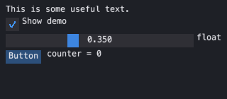

# emtk

**Dear ImGui for Python — with nothing to compile.**

*emtk* is the **E**mbeddable i**M**mediate-mode **T**ool**K**it: it embeds into whatever
hosts it (Qt, a wgpu surface, a browser, ChiSurf). It was called *cmtk* until
2026-09; that name belongs to an unrelated project on PyPI.

An immediate-mode GUI toolkit that draws through a *painter*: six operations, no
toolkit, no native extension, no build step. It runs wherever Python runs — on
a desktop wgpu surface, in a browser under Pyodide, or in a test with no
window at all — and the same widget code runs on all three.

```python
from emtk import im

with im.frame(painter, (0, 0, 320, 200)):
    im.begin("Hello, world!")
    im.text("This is some useful text.")
    changed, alpha = im.slider_float("alpha", alpha, 0.0, 1.0)
    if im.button("Button"):
        counter += 1
    im.same_line()
    im.text("counter = %d" % counter)
    im.end()
```

MIT licensed. No dependencies — not numpy, not a toolkit, not a compiler.
It is a re-implementation, and [CREDITS.md](CREDITS.md) names what it was
written by reading — Dear ImGui above all — with the upstream MIT texts in
`licenses/`.

## Quick start

```
pip install emtk
```

That is the whole install. No compiler, no toolkit, no wheel to wait for.

### 1. A frame you can run right now

emtk never opens a window itself. It draws through a *painter*, and you choose
which one — that is what lets the same widget code run on a GPU context, in a
browser, and in a test. The painter that needs nothing at all is
`PixelPainter`: it rasterises into memory, so this runs on a headless machine
and leaves a PNG behind.

```python
import emtk
from emtk.testing import PixelPainter, save_png

state = {"io": emtk.IO(), "storage": {}, "show": True, "f": 0.35, "counter": 0}

def gui():
    emtk.begin("Hello, world!")
    emtk.text("This is some useful text.")
    _, state["show"] = emtk.checkbox("Show demo", state["show"])
    _, state["f"] = emtk.slider_float("float", state["f"], 0.0, 1.0)
    if emtk.button("Button"):
        state["counter"] += 1
    emtk.same_line()
    emtk.text("counter = %d" % state["counter"])
    emtk.end()

painter = PixelPainter(320, 140, background=(30, 32, 38, 255))
# The box is inset by eight pixels so the first widget is not flush to the edge.
with emtk.frame(painter, (8, 8, 304, 124), io=state["io"], storage=state["storage"]):
    gui()

save_png("frame.png", painter.width, painter.height, painter.px)
```



Three things to notice, because they are the three that surprise people:

- **`io` and `storage` are yours to keep.** `emtk.frame` builds a fresh context
  every call; those two dicts are the only things carried across, so a widget
  that remembers anything — an open menu, a selected tab — needs the *same*
  ones each frame.
- **There is no `alpha` variable inside emtk.** `_, state["f"] = slider_float(...)`
  is the pointer rule: C++ writes through `float*`, Python has no pointers, so
  the value comes back.
- **Nothing is retained.** Delete the `emtk.button` line and the button is gone.
  There is no widget tree to keep in sync with your data.

### 2. The same frame, in a window

`emtk.qt_host.ControlHost` is a `QWidget` that paints anything with a
`draw(painter, x, y, w, h)` method and forwards pointer and key events to it.
It was written for emtk's *retained* controls, so an immediate-mode gui needs a
dozen-line adapter — which is also the clearest statement of what a host owes
emtk:

```python
import emtk

class App:
    """Adapts an immediate-mode gui to the host's control contract."""

    def __init__(self, gui):
        self.gui, self.io, self.storage = gui, emtk.IO(), {}

    def draw(self, painter, x, y, w, h):
        with emtk.frame(painter, (x, y, w, h), io=self.io, storage=self.storage):
            self.gui()

    def hover(self, px, py, *_box):
        self.io.mouse_pos = (px, py)

    drag = hover

    def press(self, px, py, *_box, **_kw):
        self.io.mouse_pos = self.io.mouse_clicked_pos[0] = (px, py)
        self.io.mouse_clicked[0] = self.io.mouse_down[0] = True

    def release(self):
        self.io.mouse_down[0] = False
        self.io.mouse_released[0] = True
```

The adapter only ever *sets* the one-shot edges (`mouse_clicked`,
`mouse_released`, the wheel, the key). It never clears them: `end_frame` does
that, which is why a button fires once on release and not again on the next
repaint.

Then the usual Qt three lines — this part needs a Qt binding
(`pip install qtpy PySide6`), which emtk itself does not:

```python
from qtpy import QtWidgets
from emtk.qt_host import ControlHost

app = QtWidgets.QApplication([])
host = ControlHost(App(gui))       # `gui` from step 1
host.resize(320, 140)
host.show()
app.exec()
```

### Where to go next

- `examples/hello_world.py` — Dear ImGui's own "Hello, world!", with the C++ it
  was transliterated from beside each line.
- `examples/clicking.py` — driving a click with no window, end to end.
- `docs/` — the full guide (`pip install emtk[docs]`, then `make -C docs html`):
  concepts, a widget-by-widget tour, the painter contract, and porting rules.
  Every example in it is a doctest, so none of it can quietly rot.

## Why

Dear ImGui is the right design for tools: the interface is the code that draws
it, there is no retained widget tree to keep in sync with your data, and a
panel is a function you can delete. Its reasons for existing are ours.

What it cannot do is ship inside a Python program without a build. The
established bindings are C++ extension modules: a wheel per platform per Python
version, a compiler for anything unwheeled, and nothing at all in a browser
under Pyodide or in an environment where you cannot install binaries. For a
scientific tool that has to run on a workstation, a cluster login node, a
colleague's laptop and a web page, that is the whole problem.

emtk is the same design, written in Python, drawing through an interface small
enough that any surface can implement it:

| | Dear ImGui | pyimgui / imgui-bundle | emtk |
|---|---|---|---|
| immediate mode | yes | yes | yes |
| needs a compiler | yes | pre-built wheels, else yes | **no** |
| runs under Pyodide / in a browser | no | no | **yes** |
| new platform | port the backend | wait for a wheel | **implement six methods** |
| pure Python | no | no | **yes** |

The cost is real and worth naming: Python draws a frame more slowly than C++,
so emtk suits tool and instrument interfaces — panels, tables, plots, editors —
rather than a game's HUD at 240 Hz.

## Compatibility with Dear ImGui

Porting is mechanical. Three rules and no thought:

| C++ | Python |
|---|---|
| `ImGui::Button("Save")` | `im.button("Save")` — `::` becomes `.` |
| `ImGui::SliderFloat` | `im.slider_float` — `CamelCase` becomes `snake_case` |
| `ImGui::Checkbox("x", &b)` | `changed, b = im.checkbox("x", b)` |

The third is the only place Python forces a difference: C++ writes results
through `bool*`, `float*` and `char*`, and Python has no pointers, so the value
comes back beside the changed flag. That is what pyimgui and imgui-bundle do,
so a port from C++ *or* from either binding lands unchanged.

Enums follow: `ImGuiCol_Button` → `im.Col.BUTTON`, `ImGuiDir_Left` →
`im.Dir.LEFT`, `ImGuiItemFlags_ButtonRepeat` → `im.ItemFlags.BUTTON_REPEAT`.

**All 362 published `ImGui::` names and all 60 `ImDrawList::` methods translate,
and all 187 sections of `imgui_demo.cpp` are ported and driven as tests** —
including docking, keyboard navigation, table sizing and `ImGuiListClipper`.
`tests/test_imgui_api_coverage.py` and `tests/test_imgui_demo_remaining.py`
prove both, and neither figure may fall.

That is not decoration. Porting the reference's own demo is how the toolkit was
found to be wrong twenty-two times — a label claiming a full-width item so the
buttons beside it were dead, `IsItemDeactivated` firing for widgets nobody had
touched, `TableNextColumn` one column out of step, `ImVec2(120, 0)` taken
literally so a button was zero pixels tall. A port that runs is the only
evidence that a re-implementation matches.

## Porting other people's ImGui code, by script

`tools/autoport.py` ports Dear ImGui C++ to emtk mechanically -- the same
rules a person applies, written down so they apply the same way every time::

    python tools/autoport/__main__.py ext.h ext.cpp --module ext --out somewhere

`ImGui::Button("Save")` becomes `im.button("Save")`; `&value` out-params
become returned tuples; `ImGuiCol_Button` becomes `im.Col.BUTTON`; `ImVec2`
becomes a tuple and `.x`/`.y` become `[0]`/`[1]`; printf varargs become `%`
formatting. What the rules cannot translate is flagged `# TODO(autoport):`
and the output is guaranteed to import either way -- a port that stops at an
`AttributeError` helps nobody.

The test cases are extensions from the
[Useful Extensions wiki page](https://github.com/ocornut/imgui/wiki/Useful-Extensions),
whose C++ ships in `tests/fixtures/extensions/` and whose ports land in
`tests/fixtures/ported/`: imgui-knobs, imgui_toggle, imgui-notify and the
imgui_club memory editor port cleanly (knobs with zero TODOs), and imspinner
-- 3,500 lines of function-like macros -- starts out as the documented
boundary where the tool flags hundreds of TODOs rather than pretending.
`tests/test_autoport.py`
ports the fixtures, renders them through a pure-Python rasterizing painter
(`emtk.testing.PixelPainter`, screenshots as PNGs with real glyphs from the
baked atlas) and asserts the pixels against committed goldens, so the auto
port provably draws what the hand-checked port draws.

A second batch of fixtures covers one category each from the same wiki page:
ImGradient (gradient editors), ImCurveEdit (curve editors), imgui_markdown
(markdown), L2DFileDialog (file dialogs), imgui_hex (hex editors) and
ImGui_Arc_ProgressBar (progress widgets). They forced the porter to grow
honest rules -- C++ character literals, ternaries nested in parentheses,
`T* out_...`/`T& v` out-parameters, `operator+` on vectors (component-wise
tuples), destructors, pointer and `size_t` casts, named `enum class`es,
`IM_ASSERT`, `ImGui::Dummy`'s ImVec2 and emtk's box-shaped `begin_child` --
and each rule is pinned by a test. Two of the batch are clean enough to
prove end-to-end: the arc progress bar renders through the porter and is
asserted pixel-exact against a committed golden; ImCurveEdit's
delegate-driven editor and imgui_markdown's parser are the boundary the
tool flags (`TODO(autoport)`) instead of faking.

A third batch takes the wiki page's heavier internal-tooling side, one
category each: ImSequencer (sequencer/timeline), ImZoomSlider (zoom
slider), GraphEditor (graph editor), imnodes (node editor), TextEditor
(text editor) and imspinner (spinner animations). The batch is honest
about weight: imnodes' editor-context internals and the TextEditor's
regex lexer are flagged regions, and nothing here renders without a
hand-built delegate -- so there is no golden this time. What the batch
proves is breadth under pressure: function-like macro definitions are
stripped and every invocation becomes a visible `expand by hand` debt
(which retires the imspinner boundary -- 60+ real spinner functions port
beside the flags), casts on qualified calls are no-ops instead of torn
receivers, named-type casts vanish, C++11 brace initialisation becomes a
ctor call, default-constructed `ImVec2`/`std::string`/vectors get their
Python defaults, `static` locals carry a semantics note, typed loop
variables untype, and file-level `static const ImColor white{...}`
constants land in the module prelude. imnodes alone still exposes 124
callable entry points; every rule above is pinned by a test.

## What a host provides

Three things, and that is the whole contract:

1. **A painter.** `emtk.painter.REQUIRED_OPERATIONS` is the list, and it is a
   list in code rather than a promise in prose: `fill_rect`, `stroke_rect`,
   `gradient_rect`, `text`, `push_clip`/`pop_clip`, `fill_triangle`, plus
   `text_width` and `line_height` to measure with. `OPTIONAL_OPERATIONS`
   (`image`, `set_font`, `text_rotated`) add what cannot be decomposed — emtk
   asks `io.BackendFlags` what the painter in hand can do and falls back
   visibly where it cannot — and `ACCELERATIONS` are faster spellings of what
   the required ones already do, which change nothing on screen.
   `tests/test_the_painter_contract.py` drives the whole widget set through a
   host that has the required operations and *nothing* else, so the claim is
   checked rather than asserted. `emtk.testing.RecordingPainter`
   records instead of drawing, which is what makes a widget testable with no
   window.
2. **Pointer and key state**, in `im.IO`: where the pointer is, which buttons
   went down or up this delivery, the modifiers, the wheel.
3. **Time.** Dear ImGui reads no clock — the backend sets `io.delta_time` and
   the context accumulates it. emtk reads the wall clock by default; set
   `io.wall_clock = False` and drive `delta_time` yourself for a fixed step, a
   recorded session, or a test of anything timing-dependent.

## Hit-testing is a by-product of drawing

There is no second list of where things are. Every widget calls
`ItemAdd(box, id)` **as it draws**, so a widget cannot be clickable where it is
not visible. Between windows the rule is the same one shape up: one list in
display order, walked forward to paint and backward to hit-test. A window that
is drawn but takes no input says so with a flag on its entry, rather than by
being absent from a second list — a second list is the thing that drifts out of
step with the first.

## Keeping last frame's drawing

A host that caches what it drew has to decide when to throw it away, and there
is a wrong way that looks right: a revision counter the control's writers bump.
The rule it needs ("everything that writes must bump") lives in every writer,
and the writer that forgets produces no error and no missing pixel -- it
produces a correct picture of an *older moment*, which reads to a user as "the
buttons do not work". A playback panel once read `1 / 464` through an entire
animation that way; every press worked, and nothing on screen said so.

`emtk.redraw` is the other way. A control says what it is about to draw --

```python
def content_key(self):
    return (self.frame, self.total, self.playing, self.stride)
```

-- and `redraw.content_key(control)` reads it, `redraw.changed(before, now)`
compares. There is nothing to remember, because the key is computed from the
same state the drawing reads. A control that cannot summarise itself returns
`redraw.always()` and is redrawn every frame: slower, never stale, and the
honest default. (`always()` is a fresh object each call, not a shared sentinel:
keys are usually tuples, and tuple equality short-circuits on element
*identity* -- a shared sentinel would compare equal to itself in the one place
it matters most.)

`redraw.BlockCache` is the host side of it: give it `(key, make)` per block and
it builds only what moved, keeps what did not, and forgets the blocks that
stopped being drawn -- the third being the one a hand-rolled dict leaks.

## Layout

```
emtk/im_core.py       the context, windows, ItemAdd, ButtonBehavior   (imgui.cpp)
emtk/im_widgets.py    everything built on those                        (imgui_widgets.cpp)
emtk/im.py            the facade you import                            (imgui.h)
emtk/drawlist.py      ImDrawList over a painter
emtk/painter.py       the six operations, and the optional three
emtk/redraw.py        content keys and the block cache: when to redraw
emtk/widgets/         retained controls: lists, trees, tables, editors, plots
emtk/testing.py       RecordingPainter
emtk/atlas/           the baked glyph atlas -- committed, so using emtk needs no font engine
tools/                not shipped: bake the atlas, scaffold an ImGui port, regenerate the name map
```

The three-file split at the top is the reference's own, and for the same
reason: the widgets are written *against* the context, so one module would have
to import the thing importing it.

## Testing a widget

No window, no toolkit, no event loop:

```python
from emtk import im
from emtk.testing import RecordingPainter

io, storage = im.IO(), {}
painter = RecordingPainter()
with im.frame(painter, (0, 0, 200, 80), io=io, storage=storage) as ctx:
    im.button("Press me")
    box = ctx.get_item_rect()

io.mouse_pos = (box[0] + 4, box[1] + 4)     # the pointer arrives
io.mouse_down[0] = io.mouse_clicked[0] = True
# ...draw again, then release, and the button reports its click.
```

`examples/clicking.py` is that, end to end. `pytest` runs the suite — 1,108
tests, in about a minute, no display required and **no toolkit installed**.
The one test that exercises the optional Qt painter skips when Qt is absent;
everything else runs on an interpreter where importing Qt raises, which is
what `tests/test_emtk_is_its_own_library.py` checks rather than assumes.

## Status

Beta. The API is Dear ImGui's, so it is stable by construction; what moves is
what has been implemented behind it. emtk grew inside
[chimol](https://github.com/tpeulen/chimol), a molecular viewer, and was moved
out once its own tests, examples and documentation stood on their own.
