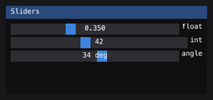

Immediate mode
==============

An immediate-mode GUI does not keep a widget tree. The interface is the
function call that draws it: a panel is a function you can delete, and there
is no retained state to keep in sync with your data.

The contrast is a *retained* GUI (Qt Widgets, tkinter, GTK), where you
construct a ``QPushButton`` once and connect its ``clicked`` signal. The
cost of retained mode is a two-way binding between your data and the
widget tree. The cost of immediate mode is that the whole UI is redrawn
every frame.

cmtk chose immediate mode because the reference (Dear ImGui) chose it for
the same reason: the UI is a tool, and a tool that *is* the code that draws
it is a tool you can delete.

The frame lifecycle
====================

A frame is one call to the widget function, inside a context manager that
manages the Dear ImGui ``NewFrame … Render`` pair::

    painter = RecordingPainter()
    with im.frame(painter, (0, 0, 300, 200)) as ctx:
        im.begin("Window")
        im.text("drawn")
        im.end()

On entry, the context ages the previous frame's state (last frame's hovered
item becomes ``hovered_id_previous_frame``), finds the window under the
pointer, and resets the layout cursor. On exit, it moves keyboard focus
according to any ``Tab`` pressed during the frame and clears per-delivery
input edges (``mouse_clicked``, ``mouse_released``).

The host provides three things, and that is the whole contract:

1. **A painter.** ``cmtk.painter.REQUIRED_OPERATIONS`` is the list of methods
   a surface must implement: ``fill_rect``, ``stroke_rect``, ``gradient_rect``,
   ``text``, ``push_clip``/``pop_clip``, ``fill_triangle``, plus ``text_width``
   and ``line_height`` to measure with.

2. **Pointer and key state**, in ``im.IO``: where the pointer is, which
   buttons went down or up this delivery, the modifiers, the wheel.

3. **Time.** Dear ImGui reads no clock — the backend sets
   ``io.delta_time``. cmtk reads the wall clock by default; set
   ``io.wall_clock = False`` and drive ``delta_time`` yourself for a test.

IDs
====

Every widget needs an identity: the hit test has to know which rectangle
the pointer just landed on, and two buttons called "Save" in different
windows have to be told apart. The ID stack provides this.

By default the label *is* the ID. Two widgets with the same label in the
same scope collide, which is why the reference's ``##`` suffix exists::

    painter = RecordingPainter()
    with im.frame(painter, (0, 0, 300, 200)):
        im.begin("Demo")
        im.button("Save")       # id = ("Demo", "Save")
        im.button("Save##2")    # id = ("Demo", "Save##2") — different widget
        im.end()

``###`` *replaces* the ID entirely while hiding the suffix from the label,
so a title that changes every frame keeps one identity::

    im.begin("Frame %d###anim" % n)  # label changes, id stays ("anim")

Nesting scopes with ``push_id`` / ``pop_id`` gives each subtree its own
namespace, so a loop body produces distinct widgets without manual
suffixes.

Hit-testing is a by-product of drawing
========================================

There is no second list of where things are. Every widget calls
``ItemAdd(box, id)`` **as it draws**, so a widget cannot be clickable where
it is not visible. The context keeps one display list, painted forward and
hit-tested backward, so what is drawn last is what takes the click.

A window that is drawn but takes no input says so with a flag on its entry
(``no_mouse_inputs``) rather than by being absent from a second list —
because a second list is the thing that drifts out of step with the first.

The six-operation painter contract
===================================

A painter implements the methods in ``REQUIRED_OPERATIONS``. Every widget
cmtk ships is built on those and nothing else. The optional operations
(``image``, ``set_font``, ``text_rotated``) add what cannot be decomposed.

The helper functions in ``cmtk.painter`` — ``line``, ``polyline``,
``fill_triangles``, ``fill_convex``, ``fill_circle`` — are built from the
required operations. A painter that provides native spellings of these
(accelerations) gets faster drawing; one that does not gets the same picture
through the fallback.

``cmtk.testing.RecordingPainter`` implements the required operations by
recording them. It is what makes every example on these pages run with no
window::

    painter = RecordingPainter()
    assert painter.text_width("abc") == 3 * 7.0   # 7 px per glyph
    assert painter.line_height() == 16.0            # 16 px per line
