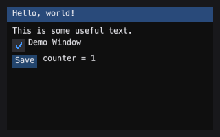

emtk — Dear ImGui for Python, with nothing to compile
===========================================================

An immediate-mode GUI toolkit that draws through a *painter*: six operations,
no toolkit, no native extension, no build step. The same widget code runs on a
desktop wgpu surface, in a browser under Pyodide, and in a test with no
window at all.

.. toctree::
   :maxdepth: 2

   install
   quickstart
   concepts
   porting
   widgets
   backends
   testing
   api

MIT licensed. Zero runtime dependencies. Python >= 3.10.

Every code example on these pages is executed by the test suite. A doc that
would silently rot is caught by ``pytest`` before it lands.
