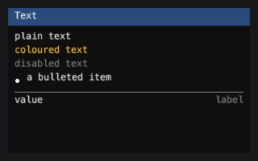
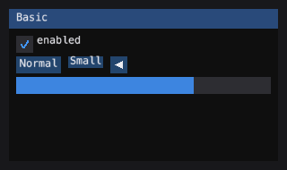
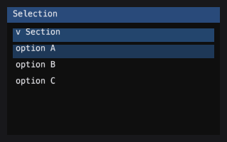
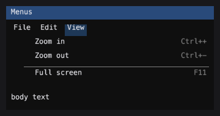
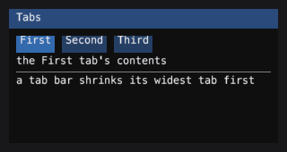
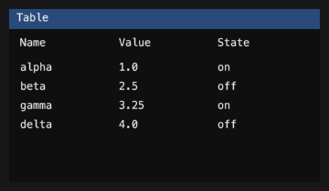
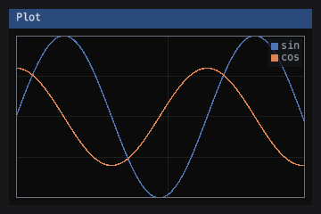

Widget guide
=============

The families below are the ones |CONTROL_MODULES| enumerates. Each
module is documented in the API reference (generated from its docstrings);
this page gives the shape of each family and a runnable example.

.. contents::

Text
----

``widgets.text`` draws strings in the seven layouts the reference
distinguishes: plain text, coloured, disabled, wrapped, bulleted, labelled
and separated.

::

    painter = RecordingPainter()
    with im.frame(painter, (0, 0, 300, 200)):
        im.begin("Text")
        im.text("plain")
        im.text_colored((255, 200, 50), "coloured")
        im.text_disabled("dimmed")
        im.bullet_text("bulleted")
        im.separator()
        im.end()

    assert "plain" in painter.strings
    assert "coloured" in painter.strings

Basic
------

``widgets.basic`` carries the foundational controls: :class:`Button`,
:class:`Checkbox`, :class:`SliderFloat`, :class:`ProgressBar`,
:class:`TreeNode`, :class:`Separator`, :class:`Toggle`,
:class:`RadioGroup`, :class:`InputInt`, :class:`Combo`,
:class:`ListBox`, :class:`Table`, :class:`Tabs`, :class:`TextInput`,
:class:`Tooltip`, :class:`ColorEdit4`, :class:`PlotLines`,
:class:`Histogram`, :class:`ScrollBar`, and the layout helper
:func:`fit_text`.

These are retained controls: they own their state and draw into a box.
The immediate-mode functions in ``im`` are the other shape.

::

    painter = RecordingPainter()
    with im.frame(painter, (0, 0, 300, 200)):
        im.begin("Basic")
        im.checkbox("enabled", True)
        im.progress_bar(0.7, (0, 0, -1, 0))
        im.end()

    assert len(painter.fills) > 0

Buttons
-------

``widgets.buttons`` adds :class:`SmallButton` (no vertical frame padding,
sits inside a line of text), :class:`InvisibleButton` (a hit box that
paints nothing), :class:`ArrowButton` (a framed button with a triangular
arrow), :class:`CheckboxFlags` (a checkbox over a bitmask, with the
reference's *mixed* state), and :class:`RadioButton`.

::

    painter = RecordingPainter()
    with im.frame(painter, (0, 0, 300, 200)):
        im.begin("Buttons")
        im.button("Normal")
        im.small_button("Small")
        im.arrow_button("arrow", im.Dir.LEFT)
        im.end()

    assert "Normal" in painter.strings
    assert "Small" in painter.strings

Sliders
--------

``widgets.sliders`` ports the full slider family: horizontal and vertical,
float and integer, linear and logarithmic, single and multi-component, and
:func:`slider_angle` (radians stored, degrees shown). The reference's
``ScaleRatioFromValueT`` / ``ScaleValueFromRatioT`` pair is ported
faithfully, including the awkward half: a logarithmic slider cannot take
``log(0)``, so the bounds are fudged away from zero by an epsilon derived
from the format string's precision.

.. image:: _screenshots/sliders.png
   :alt: Float, integer and angle sliders

::

    painter = RecordingPainter()
    with im.frame(painter, (0, 0, 300, 200)):
        im.begin("Sliders")
        changed, f = im.slider_float("float", 0.5, 0.0, 1.0)
        changed, i = im.slider_int("int", 5, 0, 100)
        im.end()

    assert isinstance(f, float)
    assert isinstance(i, int)

Drag
----

``widgets.drag`` provides scrubbing controls: a number you scrub rather
than a slider you aim. The box is only where the gesture *starts*; from
then on the value moves by the mouse's delta, scaled by ``v_speed``. An
integer drag at a tenth of a unit per pixel would round every single event
to zero and never move at all — the reference fixes this with an
accumulator (``g.DragCurrentAccum``), ported faithfully here.

::

    painter = RecordingPainter()
    with im.frame(painter, (0, 0, 300, 200)):
        im.begin("Drag")
        changed, v = im.drag_float("drag", 1.0, 0.01)
        im.end()

    assert isinstance(v, float)

Inputs
------

``widgets.inputs`` ports the reference's scalar editor: a field you type a
number into, with optional ``-``/``+`` buttons and a printf format that
decides both how the value is shown and how the typed string is read back.
Also carries ``InputTextMultiline`` and ``InputTextWithHint``.

Colour
------

``widgets.color`` ports the reference's colour family: a swatch
(:class:`ColorButton`), a numeric editor (:class:`ColorEdit4` and
:class:`ColorEditRGB`), and a saturation/value picker with a hue bar
(:class:`ColorPicker4`). The hue-state bug is avoided structurally:
:class:`ColorState` holds H, S, V and the byte triple side by side, so a
drag on the hue bar cannot snap to red at the white or black edge.

Selection
----------

``widgets.selection`` ports :class:`Selectable`,
:class:`CollapsingHeader`, and the multi-select model
(:class:`MultiSelectState`) that turns clicks plus modifiers into
selection requests.

::

    painter = RecordingPainter()
    with im.frame(painter, (0, 0, 300, 200)):
        im.begin("Selection")
        im.selectable("option A")
        im.selectable("option B")
        im.collapsing_header("Section")
        im.end()

    assert "option A" in painter.strings

List view
----------

``widgets.list_view`` provides virtualised lists: the view asks the model
for the rows it is about to draw and no others, so a list of a hundred
thousand rows costs the same as a list of twenty.

Menus
------

``widgets.menus`` ports :class:`MenuBar`, :class:`Menu`,
:class:`MenuItem`, :class:`Popup`, and :class:`PopupModal`.

Tabs
----

``widgets.tabs`` ports the reference's full tab bar: measured per-tab
widths, shrinking (the widest tab pays first), scrolling (with the
selected tab kept visible), and reordering by drag.

Tables
------

``widgets.tables`` ports the reference's data table: sized, resized,
reordered, multi-sorted, frozen, clipped.

::

    painter = RecordingPainter()
    with im.frame(painter, (0, 0, 300, 200)):
        im.begin("Table")
        im.begin_table("t", 3)
        for col in range(3):
            im.table_setup_column(f"Col {col}")
        im.table_headers_row()
        im.table_next_row()
        for col in range(3):
            im.table_next_column()
            im.text(f"{col}")
        im.end_table()
        im.end()

Declared tables
---------------

``widgets.data_table`` draws the tables a ChiSurf ``view.json`` declares --
``{"type": "table"}`` and ``{"type": "custom", "key": "data_table"}`` -- the
way AutoForm's Qt renderer reads them: records or named arrays from a model
``source``, column specs, values sorted as values, selection into
``selected_call``, and a refresh that notices a source growing while a
computation streams. A column with ``"display": "bar"`` and a ``range`` draws
its value as a bar under the text (diverging, coloured by sign, when the range
spans zero). :func:`emtk.widgets.view_spec.table_bindings` and
:class:`emtk.widgets.view_spec.ViewSpecPanel` render them from a retained
panel; :mod:`emtk.view_form` draws them in an immediate-mode form.

::

    from emtk.widgets.data_table import TableBinding

    class Ranking:
        def rows(self):
            return [{"score": 0.8, "x": "Tau"}, {"score": -0.3, "x": "N"}]

    section = {"type": "custom", "key": "data_table", "options": {
        "source": "rows", "sort": {"key": "score", "descending": True},
        "columns": [{"key": "score", "display": "bar", "range": [-1, 1]},
                    {"key": "x"}]}}
    binding = TableBinding(section, Ranking())
    painter = RecordingPainter()
    binding.control.draw(painter, 0, 0, 300, 120)
    assert "Tau" in painter.strings

Drag and drop
-------------

``widgets.dragdrop`` ports the reference's drag-and-drop: :class:`Payload`,
:class:`DragDropSource`, :class:`DragDropTarget`, and the
:class:`DragDropContext` state machine.

Text editor
------------

``widgets.text_editor`` is the port of ImGuiColorTextEdit: a colourising
text editor with syntax highlighting, bracket matching, undo/redo, and
multiple cursors.

Memory editor
--------------

``widgets.memory_editor`` ports the imgui_club memory editor: a hex viewer
and editor for any buffer the host provides.

Layout
-------

``layout`` carries the layout cursor: the arithmetic that decides where the
next widget goes.

:func:`~emtk.im_widgets.splitter` is the draggable divider between two
resizable panes, and :func:`~emtk.im_widgets.splitter_behavior` is the drag
on its own for a window that draws its own bar. The sizes come back rather
than being written through pointers, as everywhere else in ``im``:

.. doctest::

    >>> import emtk
    >>> from emtk.testing import RecordingPainter
    >>> state = {"left": 150.0, "right": 242.0}
    >>> def two_panes():
    ...     im.begin("panes")
    ...     x, y = im.get_cursor_screen_pos()
    ...     im.begin_child((x, y, state["left"], 200.0))
    ...     im.text("controls")
    ...     im.end_child()
    ...     im.same_line(0.0, 0.0)
    ...     moved, state["left"], state["right"] = im.splitter(
    ...         "##v", im.Axis.X, 12.0, 200.0,
    ...         state["left"], state["right"], 60.0, 80.0)
    ...     im.same_line(0.0, 0.0)
    ...     im.end()
    ...     return moved
    >>> with emtk.frame(RecordingPainter(), (0, 0, 400, 300)):
    ...     moved = two_panes()
    >>> moved, state["left"], state["right"]
    (False, 150.0, 242.0)

``thickness`` is the space the divider takes and the size of the grab
target; ``bar_margin`` insets what is actually drawn, so a bar that is easy
to hit does not have to look like a slab. ``min_size1`` and ``min_size2``
both hold at once, so a drag stops at whichever limit it reaches first
instead of collapsing the other pane.

Splitter
---------

``widgets.splitter`` is the same control retained: it owns the boundary, and
:meth:`~emtk.widgets.splitter.Splitter.split` hands back the three rectangles
a two-pane layout is made of, already clamped.

.. doctest::

    >>> from emtk.widgets.splitter import Splitter
    >>> sp = Splitter(150.0, thickness=12.0, min_size1=60.0, min_size2=80.0)
    >>> pane1, bar, pane2 = sp.split(0.0, 0.0, 400.0, 300.0)
    >>> pane1, bar, pane2
    ((0.0, 0.0, 150.0, 300.0), (150.0, 0.0, 12.0, 300.0), (162.0, 0.0, 238.0, 300.0))

They tile the region exactly. A resize too small for the starting sizes
clamps rather than inverting a pane -- and when the region cannot hold both
minimums at once, the first pane keeps its own and the second is squeezed
below it, which is arbitrary but stable. The alternative is a boundary that
jumps between the two limits as the window resizes:

.. doctest::

    >>> pane1, bar, pane2 = sp.split(0.0, 0.0, 150.0, 300.0)
    >>> sp.size1, sp.size2
    (60.0, 78.0)
    >>> pane1[2] + bar[2] + pane2[2]
    150.0

Control
--------

``control`` defines the :class:`~emtk.control.Control` base class: the
contract every retained control follows.

Axis and markers
-----------------

``widgets.axis`` ports the implot linear axis.
``widgets.markers`` provides scatter-plot marker shapes.

Plot
----

``widgets.plot`` ports the implot ``BeginPlot`` / ``PlotLine`` /
``EndPlot`` pattern as a context manager.

::

    painter = RecordingPainter()
    with im.frame(painter, (0, 0, 300, 200)):
        im.begin("Plot")
        im.end()

    assert painter is not None

``implot`` gives the same plot ImPlot's free-function shape
(``begin_plot`` / ``plot_line`` / ``end_plot``). Beyond ImPlot it takes a
dash pattern in ``set_next_line_style(colour, weight, dash=(on, off))`` -- a
prior drawn dashed beside its solid posterior -- and it honours
``set_next_marker_style`` and ``AXIS_FLAGS_NO_TICK_LABELS``; a log axis ticks
on whole decades.

File dialog
-----------

``file_dialog.FileDialog`` chooses files to open or a file to save, drawn by
emtk inside any window: filters (the chosen one comes back as
``filter_index``), multi-selection, a save-mode name field that appends the
filter's extension, and paging. Dear ImGui has none, a browser host has no
native one, and a test cannot press a native dialog's buttons.

::

    from emtk.file_dialog import FileDialog

    dialog = FileDialog("Load", filters="Sessions (*.mat);;Raw (*.dat)")
    painter = RecordingPainter()
    with im.frame(painter, (0, 0, 400, 400)):
        im.begin("Load")
        result = dialog.draw()
        im.end()

    assert result is None

Circle plot
------------

``widgets.circle`` is a Circos-style circular layout, ported from
pyCirclize.

DrawList
---------

``drawlist`` provides ``ImDrawList`` names over any :class:`Painter`:
``add_line``, ``add_rect_filled``, ``add_circle_filled``.

::

    painter = RecordingPainter()
    with im.frame(painter, (0, 0, 300, 200)):
        im.begin("DrawList")
        dl = im.get_window_draw_list()
        dl.add_rect_filled(10, 10, 80, 40, (80, 80, 80, 255))
        im.end()

    assert painter.fills
